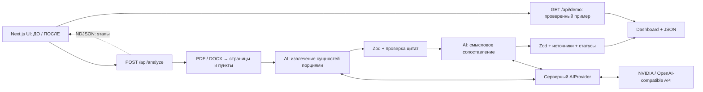

# OrgLens

**Интеллектуальный анализ организационных изменений.** Хакатонный MVP для кейса «ИИ-агент: Анализ организационной структуры и функционала».

Два документа → структурированные функции и подразделения → смысловое сопоставление → выводы с проверяемыми цитатами.

## Быстрый старт

Нужен **Node.js 22.13+** (рекомендуется Node.js 24 LTS) и npm. Откройте терминал **в папке проекта**, где лежит этот README.

```sh
npm install
npm run dev
```

Откройте http://127.0.0.1:3000. Без настройки API можно нажать **«Открыть пример»**. Если `.env.local` уже содержит `DEMO_MODE=true`, нажмите **«Начать анализ»** — появится тот же проверенный пример.

Чтобы включить деморежим на новом компьютере, скопируйте `.env.example` в `.env.local` (команды ниже). Для демонстрации API-ключ не нужен. Не переносите `node_modules` и `.next` между компьютерами: каждый участник выполняет `npm install` самостоятельно.

## Проблема

После реорганизации названия подразделений, номера пунктов и формулировки функций меняются. Обычный текстовый diff легко принимает перенос функции за её потерю. Эксперту нужны не только выводы, но и основания, позволяющие их проверить.

## Решение

- Два поля загрузки: **ДО** и **ПОСЛЕ**.
- PDF с текстовым слоем и DOCX.
- Выявление новых, исключённых, переименованных и сохранённых подразделений, изменения подчинённости.
- Сопоставление сохранённых, переданных, изменённых, новых и потенциально потерянных функций.
- Гипотезы о дублировании и пересечениях ответственности.
- Dashboard: оргструктура, функции, риски, заключение.
- Для каждого наблюдения — документ, редакция, пункт, страница PDF и исходная цитата.
- Экспорт всего отчёта в JSON.

## Как работает AI-агент

1. Сервер проверяет формат, размер и текстовый слой файлов. PDF разбирается постранично; DOCX — в текст без фиктивных номеров страниц.
2. Текст разделяется на разделы и пункты. Каждому фрагменту назначается неизменяемый ID и привязка к источнику.
3. Документы отправляются модели **порциями до 12 000 символов**. На этом этапе модель извлекает подразделения и функции с исполнителями и цитатами. Исходные документы не отправляются целиком одним prompt.
4. Ответы проверяются Zod. Каждая цитата должна буквально присутствовать в указанном фрагменте с учётом нормализации пробелов и Unicode.
5. Модель получает структурированные сущности обеих редакций и сопоставляет их по смыслу, включая переносы между исполнителями и смену нумерации. Это не простой string diff.
6. Сервер повторно проверяет схему, ссылки, сторону ДО/ПОСЛЕ и цитаты. Выдуманное доказательство отклоняет весь результат. Сравнение без второй стороны понижается до неопределённого. Потери, дубли и конфликты не могут стать установленными фактами автоматически.
7. Заключение реального анализа формируется сервером из подтверждённых наблюдений и вопросов для проверки со ссылками на их ID; рядом доступны все основания. Прогресс передаётся интерфейсу потоком NDJSON.

Команды, обнаруженные **внутри документов**, считаются недоверенным содержимым, а не инструкциями агенту. Системный prompt явно отделяет их от задачи. Это снижает риск prompt injection, но не заменяет экспертную проверку смысла.

### Статусы

| Статус | Значение |
| --- | --- |
| Подтверждено текстом | Приведённые фрагменты поддерживают вывод; фактическое выполнение работ не проверялось |
| Возможно · нужна проверка | Есть основание для гипотезы, но недостаточно для установления факта |
| Недостаточно данных | Нет достаточных доказательств или невозможно однозначно распределить ответственность |

Проценты уверенности — эвристика модели (в демо — ручная оценка), **не статистическая вероятность**. Проверка цитаты гарантирует её присутствие, но не корректность интерпретации.

## Архитектура



Хранилище не требуется: файлы и результаты не сохраняются сервером. Отчёт находится в памяти браузера до обновления страницы; для сохранения используйте JSON. Supabase сознательно исключён из MVP для простого старта.

## Технологии

Next.js App Router, React, TypeScript, Tailwind CSS, CSS, серверные Route Handlers, Zod, pdf-parse/PDF.js, mammoth, lucide-react. Точные версии зафиксированы в `package-lock.json`.

AI-провайдер подключается через обычный серверный `fetch` к `/chat/completions`. SDK конкретного поставщика не требуется. Интерфейс `AIProvider` позволяет заменить реализацию отдельно от анализа.

## Установка на Windows

Установите Node.js 24 LTS. Распакуйте проект в обычную локальную папку. Откройте её в VS Code → Terminal → New Terminal. В PowerShell:

```powershell
npm install
Copy-Item .env.example .env.local
npm run dev
```

Если `.env.local` уже настроен, **не выполняйте повторное копирование**. Если PowerShell блокирует `npm.ps1`, используйте `npm.cmd install` и `npm.cmd run dev` либо терминал cmd; менять политику безопасности не нужно.

## Установка на macOS

Установите Node.js 24 LTS. Откройте терминал в папке проекта:

```sh
npm install
cp .env.example .env.local
npm run dev
```

Если `.env.local` уже настроен, пропустите копирование. Остановка сервера — `Ctrl+C`.

Одинаковые npm-команды работают на обеих ОС. В коде нет абсолютных путей к файлам разработчика. `scripts/dev.mjs` включает переносимый polling для наблюдения за изменениями файлов, чтобы не упираться в лимиты файловых наблюдателей.

## Переменные окружения

Создайте `.env.local` на основе `.env.example`. Все переменные используются сервером; префикс `NEXT_PUBLIC_` для секретов запрещён.

| Переменная | Значение |
| --- | --- |
| `DEMO_MODE` | `true`: основной сценарий показывает фиксированный пример; `false`: анализирует выбранные файлы |
| `AI_API_KEY` | Ключ выбранного AI-провайдера. Для демо пусто |
| `AI_BASE_URL` | URL API, включая `/v1`, без `/chat/completions` |
| `AI_MODEL` | Точный идентификатор доступной вашему аккаунту модели |
| `AI_TIMEOUT_MS` | Ожидание одного запроса, по умолчанию `90000`; допустимый диапазон 5000–180000 мс |

После изменений перезапустите сервер. `.env.local` исключён из Git. Реальных ключей в проекте нет.

Пример реального режима:

```dotenv
DEMO_MODE=false
AI_API_KEY=ваш_ключ
AI_BASE_URL=https://integrate.api.nvidia.com/v1
AI_MODEL=идентификатор_модели_из_вашего_аккаунта
AI_TIMEOUT_MS=90000
```

Не используйте слова-заполнители как действующие ключ или модель. Секрет заполняет участник команды на своём компьютере.

## NVIDIA API

1. Откройте [NVIDIA API Catalog](https://build.nvidia.com/) и выберите доступную вашему аккаунту текстовую instruction/chat-модель.
2. Возьмите ключ и **точное имя модели из примера API** на её странице. Доступность и квоты зависят от аккаунта, поэтому имя не зашито в приложение.
3. Заполните переменные выше. Рекомендуемый контекст модели — от 64k токенов, желательно 128k, поддержка русскоязычных документов и ответов JSON.
4. Установите `DEMO_MODE=false`, перезапустите `npm run dev`, загрузите два PDF и нажмите «Начать анализ».

Используется OpenAI-compatible endpoint [NVIDIA Chat Completions](https://docs.api.nvidia.com/nim/re/reference/llm-apis). Для другого совместимого сервиса измените `AI_BASE_URL`, `AI_MODEL`, `AI_API_KEY`. Модель должна поддерживать `messages`, `temperature`, `max_tokens` и возвращать `choices[0].message.content`. JSON запрашивается инструкцией и обязательно валидируется; специфичный `response_format` не используется ради совместимости. Модели с иным контрактом требуют адаптации `provider.ts`.

Реальный запуск включает несколько запросов и может расходовать квоту. Текст отправляется выбранному провайдеру, о чём сообщает интерфейс. Демопример не отправляет текст во внешний AI API. Ошибка API никогда не подменяется демоданными автоматически.

## Структура проекта

```text
app/
  page.tsx                  Загрузка, прогресс, dashboard, evidence, экспорт
  globals.css               Адаптивное оформление
  api/config/route.ts       Режим сервера без раскрытия ключей
  api/analyze/route.ts      Проверка загрузки и поток прогресса
  api/demo/route.ts         Явный демопример
lib/
  schema.ts                 TypeScript + Zod
  evidence.ts               Проверка цитат и понижение статусов
  errors.ts                 Понятные ошибки
  documents/parse.ts        PDF/DOCX, ограничения
  documents/structure.ts    Разделы, пункты, ссылки
  ai/provider.ts            Сменный AI-провайдер
  ai/analyze.ts             Извлечение и смысловое сопоставление
  demo/report.json          12 наблюдений с реальными цитатами
public/demo/
  revision-8.pdf            Исходный обезличенный PDF ДО
  revision-9.pdf            Исходный обезличенный PDF ПОСЛЕ
scripts/dev.mjs             Переносимый запуск dev-сервера
tests/                      Проверки parsing, evidence, AI-контракта
.env.example                Шаблон без секретов
```

## Демо для судей — 2 минуты

**0:00–0:20.** Откройте приложение. Покажите редакции 8 и 9. Скажите: «После реорганизации нужно понять, куда перешли функции, и доказать каждый вывод документом». Нажмите «Начать анализ» в деморежиме или «Открыть пример».

**0:20–0:50.** Во вкладке «Оргструктура» откройте «ДИТААД включён в структуру БВА». Покажите п. 3.4 обеих редакций рядом. В старой — два департамента, в новой — четыре. Ссылка открывает исходный PDF на соответствующей странице.

**0:50–1:20.** Во вкладке «Функции» откройте «Карта гарантий: функция передана, а не потеряна». Покажите переход из п. 5.4.4 в п. 5.3.3. Объясните, почему сравнение по номерам пунктов дало бы ошибку.

**1:20–1:45.** Во вкладке «Риски» откройте изменение обязательности контрольных процедур: «осуществляется» → «может осуществляться». Покажите статус «Возможно · нужна проверка». Агент не выдаёт риск за установленную потерю.

**1:45–2:00.** Откройте «Заключение», затем «Скачать JSON». Честно уточните: «Сейчас показан заранее проверенный демопример. Для своих документов предусмотрен отдельный режим анализа через AI API».

### Происхождение демоданных

Данные взяты из предоставленных обезличенных положений о внутреннем аудите, редакций 8 и 9, по 25 страниц. Все 27 цитат автоматически сверяются с текстом на указанных страницах обоих PDF в тестах. Это 12 вручную отобранных наблюдений, **не исчерпывающий отчёт**. Структурных изменений в карточке 3: два новых департамента и изменённое прямое подчинение. Сохранение ДНМ и ДККМ показано отдельно и не увеличивает счётчик изменений.

Названия организаций внутри обезличенных документов не заменялись на Казахтелеком. Перечень созданных, удалённых и переименованных подразделений заполняется только при наличии оснований. В этой выборке прямое удаление и переименование не установлены.

## Проверка проекта

```sh
npm run lint
npm run typecheck
npm test
npm run build
npm run test:api
```

`test:api` поднимает production-сервер на свободном локальном порту и тестовый AI-сервис. Он отправляет оба PDF через HTTP, проверяет поток этапов, результат, ошибки загрузки и демопример. Внешний API не используется.

Для проверки production-версии остановите dev-сервер:

```sh
npm start
```

Для надёжного выступления можно заранее выполнить сборку и использовать `npm start` — начальная компиляция не потребуется.

Ручная проверка:

1. Откройте демо, пройдите четыре вкладки, раскройте доказательства, откройте PDF и скачайте JSON.
2. В AI-режиме попробуйте неверный формат, пустой и слишком большой файл — должно появиться понятное сообщение.
3. Без `AI_API_KEY` получите сообщение о настройке, а не stack trace.
4. С реальным ключом загрузите оба PDF. Дождитесь этапов извлечения, сопоставления, проверки цитат и заключения.
5. Сверьте несколько цитат с оригиналами. Проверьте, что перенос Карты гарантий не назван потерей.

Автотесты используют реальный PDF-parser и тестовый AI-провайдер. Проверяется полный серверный конвейер, HTTP-контракт совместимого API, невалидный JSON, ошибки API, отмена, неизвестные цитаты, неправильная сторона, пределы файлов. Эти тесты **не доказывают качество ответов реальной модели**. Прямой вызов NVIDIA без ключа не проверялся. Windows-команды переносимы, но запуск на физическом Windows-компьютере здесь не выполнялся.

## Ограничения MVP

- До 10 МБ, 80 страниц PDF и 180 000 символов на документ. До 150 000 символов в извлечённом представлении для сопоставления; больший контекст отклоняется явно, без скрытого обрезания.
- Весь анализ ограничен примерно 9,5 минутами; один запрос AI — настраиваемым timeout. Большие документы и медленные модели могут не уложиться.
- Только текстовый PDF. OCR, сложные таблицы, схемы оргструктуры и текст на изображениях не поддерживаются.
- DOCX поддерживается базово: отсутствуют страницы, автоматические Word-номера списков могут теряться. Для надёжных ссылок экспортируйте в текстовый PDF.
- Разбиение по пунктам эвристическое. Нет полной нормализации всех форматов документов. Буквальное присутствие цитаты не гарантирует правильное распознавание раздела.
- Извлечение сущностей и смысловое сопоставление зависят от модели и не гарантируют полноту. Новое название не доказывает новое подразделение; отсутствие упоминания не доказывает удаление.
- Демоданные ручные, с явной маркировкой; они не зависят от загруженных файлов. В деморежиме загрузка заблокирована, чтобы исключить подмену анализа.
- Нет аккаунтов, базы, истории, совместного доступа, OCR или PDF-экспорта отчёта. Есть экспорт JSON.
- Запуск привязан к `127.0.0.1`. Это локальный MVP, не публичный сервис. Для публичного развёртывания нужны авторизация, ограничения запросов, очередь/worker, защита загрузки на уровне reverse proxy и согласованная политика хранения. In-memory ограничение «один анализ» действует только в одном процессе.
- Включённые обезличенные примеры доступны в `public/demo`. Для другой поставки удалите или замените их, если не хотите распространять эти примеры.

## Если что-то пошло не так

| Сообщение | Что сделать |
| --- | --- |
| Не задан AI_API_KEY | Заполнить `.env.local` или включить деморежим и перезапустить |
| AI API недоступен | Проверить точное имя модели, ключ и base URL; не дописывать `/chat/completions` |
| AI вернул невалидный JSON | Повторить или выбрать более подходящую instruction-модель |
| Цитата не найдена | Ответ модели отклонён; повторить анализ, проверить качество PDF |
| Время ожидания истекло | Выбрать более быструю модель/меньшие документы; можно увеличить timeout до 180000 |
| Текст не обнаружен | Сделать OCR вне приложения и сохранить PDF с текстовым слоем |
| Порт 3000 занят | `npm run dev -- --port 3001`, затем открыть http://127.0.0.1:3001 |
| Результат исчез после обновления | В MVP нет истории; сохраняйте JSON перед обновлением |

## Дальнейшее развитие

Семантический поиск по embeddings с проверкой кандидатов в обе стороны; многоэтапная сверка полноты; RACI-матрица; OCR и таблицы; эталонная выборка и измерение precision/recall; фоновые задания; авторизация и Supabase; история версий и экспорт отчёта в PDF.

## Работа втроём

Первый участник ведёт интерфейс и demo flow, второй — документы и проверку цитат, третий — AI-настройки, README и тесты. Перед объединением изменений запускайте четыре проверки выше. В Git передавайте исходники, `package.json`, `package-lock.json` и `.env.example`; **не передавайте `.env.local`, `.next` и `node_modules`**.

Справочные материалы: [Next.js Installation](https://nextjs.org/docs/app/getting-started/installation), [NVIDIA LLM APIs](https://docs.api.nvidia.com/nim/re/reference/llm-apis).
